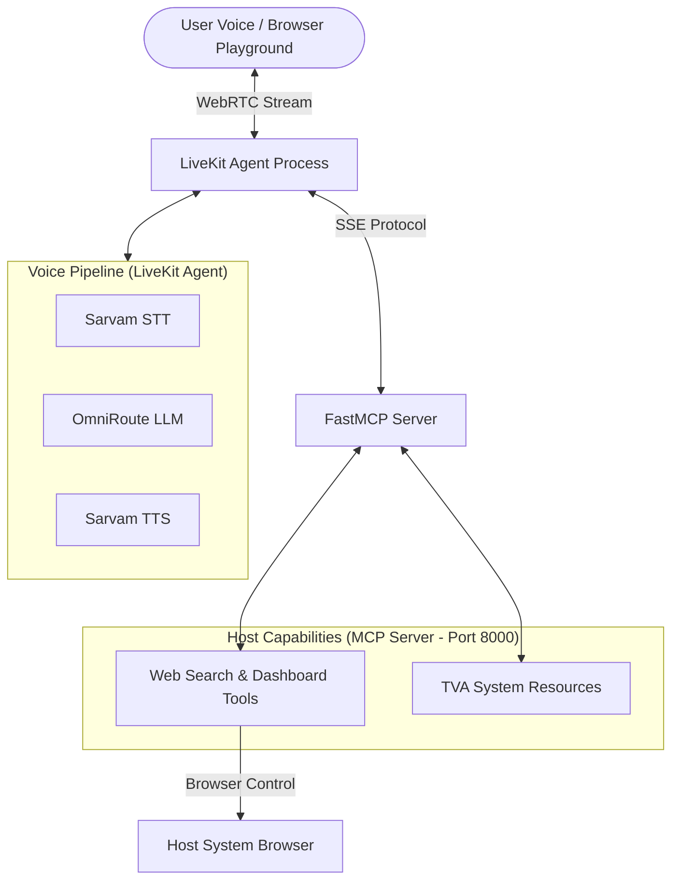

# ⏰ Miss Minutes AI Assistant

A voice-enabled AI assistant modeled after **Miss Minutes** from the Time Variance Authority (TVA). 

Built using a modern dual-process architecture: an **MCP Server** for tools/capabilities and a **LiveKit Voice Agent** for real-time natural speech interaction.

---

## 🏗️ Architecture Overview

The system is decoupled into two separate processes running locally:



### Key Components

1. **MCP Server (`server.py`)**: Runs on `http://127.0.0.1:8000/sse` using FastMCP. It provides extensible tools (like world news, finance dashboards, browser control) and static TVA resources.
2. **Voice Agent (`agent.py`)**: Connects to LiveKit Cloud via WebRTC. It hooks into the MCP server over SSE to dynamically discover and invoke tools based on user speech.

---

## 🚀 Quickstart

### 1. Installation

Ensure you have `uv` installed, then install dependencies:

```bash
cd backend
uv sync
```

### 2. Environment Configuration

Copy `.env.example` to `.env` inside the `backend/` directory:

```bash
cp .env.example .env
```

Configure your credentials:
- **LiveKit**: `LIVEKIT_URL`, `LIVEKIT_API_KEY`, `LIVEKIT_API_SECRET`
- **OmniRoute**: `OMNIROUTE_BASE_URL`, `OMNIROUTE_API_KEY`, `OMNIROUTE_MODEL`
- **Sarvam AI**: `SARVAM_API_KEY`, `SARVAM_SPEAKER`, `SARVAM_MODEL`, `SARVAM_LANGUAGE_CODE`
- **Web Search & News Tools**: `NEWSAPI_KEY`, `FIRECRAWL_API_KEY`

---

## 🏃 Running the Assistant

Run the two processes in separate terminal windows:

### Terminal 1: MCP Server
```bash
cd backend
uv run miss_minutes
```

### Terminal 2: Voice Agent
```bash
cd backend
uv run miss_minutes_voice
```

Once running, connect via the [LiveKit Agents Playground](https://agents-playground.livekit.io/) to start talking to Miss Minutes!

---

## 🎭 Persona & Tone

Miss Minutes maintains a bright, warm, southern drawl while remaining strictly loyal to the TVA and the Sacred Timeline. She uses terms like *"hon"*, *"y'all"*, and *"sweetie"* while casually referencing pruning, time streams, and TVA bureaucracy.